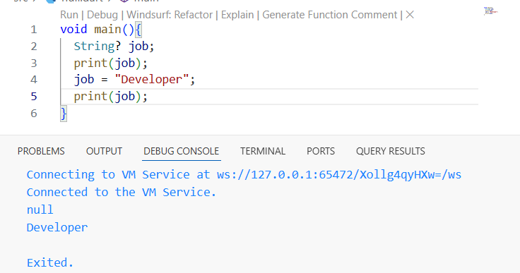
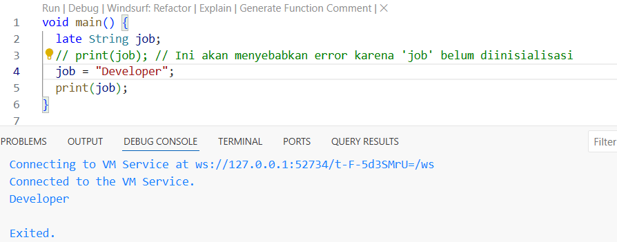

# Pemrograman Mobile - Pertemuan 2

Project Hello Wolrd

NIM : 2341720106

NAMA : Ahmad Dzul Fadhli Hannan

# Jawaban Tugas

## Soal 1  
  

Dengan mengganti teks seperti di contoh lalu ubah operasinya menjadi 18 - i dimana iterasi akan dimulai dari 18 - 0 terus sampai 18 dikurangi jumlah iterasi sebanyak 10.

## Soal 2  
Karena semua pengembangan framework Flutter melibatkan pengetahuan/fitur mendalam dengan bahasa Dart; Kode aplikasi, kode plugin, dan manajemen dependensi semuanya menggunakan bahasa Dart beserta fitur-fiturnya. Memiliki pemahaman dasar yang kuat tentang Dart akan memudahkan Anda untuk menjadi lebih produktif dengan Flutter dan akan membuat Anda merasa nyaman dalam pengembangan Flutter.

## Soal 3

### 1. Dart sebagai Fondasi Flutter 
    Dart adalah inti dari Flutter. Memahami Dart sangat penting untuk menjadi pengembang Flutter yang produktif.

### 2. Kelebihan Dart 

    - Productive tooling: Memiliki tool yang lengkap untuk analisis kode, plugin IDE, dan ekosistem paket yang besar.

    - Garbage collection: Mengelola memori secara otomatis.

    - Statically typed: Meskipun type annotations opsional, Dart aman karena menganalisis tipe data saat kompilasi (compile time) untuk mendeteksi bug lebih awal.

    - Portability: Kode Dart bisa dikompilasi ke JavaScript (untuk web) atau kode native (untuk mobile).

### 3. Cara Kerja Dart: Kode Dart dieksekusi melalui dua mode kompilasi utama

    - Kompilasi Just-In-Time (JIT): Digunakan saat pengembangan, memungkinkan fitur hot reload yang mempercepat debugging.

    - Kompilasi Ahead-Of-Time (AOT): Digunakan saat release untuk performa yang lebih baik.

### 4. Struktur Dasar Bahasa

    - Object-Oriented (OO): Dart adalah bahasa berorientasi objek, yang didasarkan pada konsep class dan object.

    - Operator: Operator seperti +, -, *, /, ==, dan != pada Dart bekerja seperti bahasa lain, namun memiliki implementasi method di balik layarnya.

    - Fungsi Utama main(): Setiap aplikasi Dart harus memiliki fungsi main() sebagai titik awal eksekusi.

## Soal 4  

1. Null Safety di Dart adalah fitur yang mencegah error akibat nilai null. Secara default, variabel tidak boleh null. Untuk membuatnya bisa null, tambahkan tanda tanya (?) setelah tipe data, seperti String?.  

2. Late variabel adalah cara untuk mendeklarasikan variabel tanpa memberinya nilai langsung. Variabel ini harus diinisialisasi sebelum digunakan, kalau tidak akan terjadi error saat program berjalan.  

  