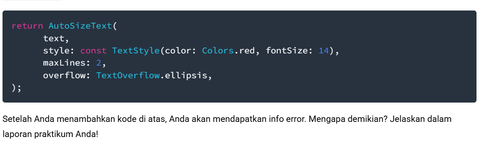
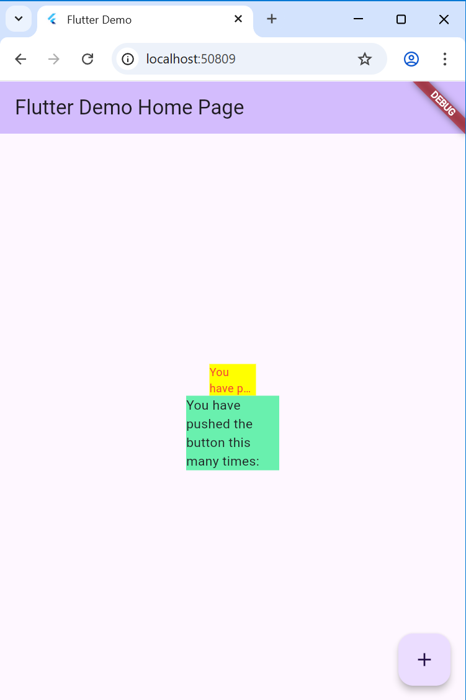
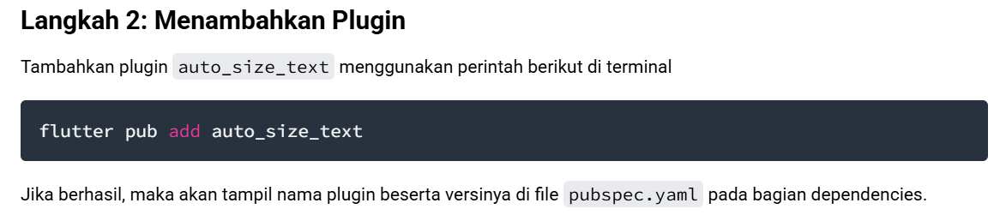
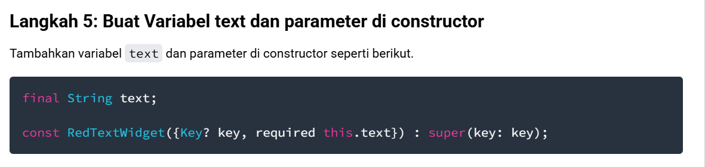
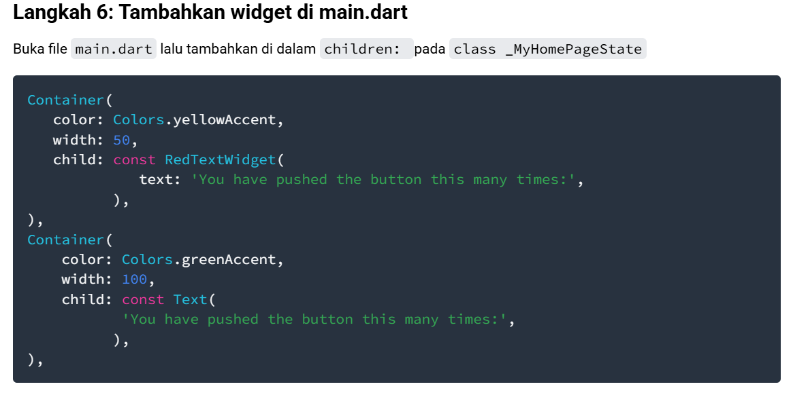

# Pemograman Mobile - Pertemuan 7  

## Tugas Praktikum  

### Soal 1  

**Praktikum**

  

**Jawaban:**  

**Hasil Akhir** 

### Soal 2

**Jawaban:**  Mengunduh paket auto_size_text dari internet dan mendaftarkannya sebagai dependensi dalam file pubspec.yaml agar widget AutoSizeText bisa digunakan di dalam proyek.

### Soal 3 

**Jawaban:**  Untuk membuat widget RedTextWidget dapat menerima data teks secara dinamis dari luar melalui constructor-nya, sehingga teks yang ditampilkan tidak lagi statis dan bisa diubah-ubah.

### Soal 4

**Jawaban:**  Kedua widget tersebut sama-sama menampilkan teks di dalam sebuah kotak berwarna, perbedaannya adalah widget pertama menggunakan RedTextWidget kustom yang membuat teks berwarna merah dan ukurannya otomatis menyesuaikan diri, sementara widget kedua menggunakan Text standar dari Flutter yang ukurannya tetap.

### Soal 5

**Jawaban:**

- **text**: Teks yang akan ditampilkan.  
- **style**: Gaya visual teks (warna, ketebalan, dll).  
- **minFontSize**: Ukuran font terkecil yang diizinkan.  
- **maxFontSize**: Ukuran font terbesar yang diizinkan.  
- **stepGranularity**: Interval perubahan ukuran font saat menyesuaikan diri.  
- **presetFontSizes**: Daftar ukuran font spesifik yang boleh digunakan.  
- **maxLines**: Jumlah baris maksimal untuk teks.  
- **overflow**: Aksi jika teks meluap (misal: ...).  
- **overflowReplacement**: Widget pengganti jika teks meluap.  
- **group**: Menyeragamkan ukuran font di beberapa AutoSizeText berbeda.  
- **textAlign**: Perataan teks horizontal (kiri, tengah, kanan).  
- **wrapWords**: Memastikan teks terpotong per kata, bukan per karakter.  

### Soal 6

**Kumpulkan**

