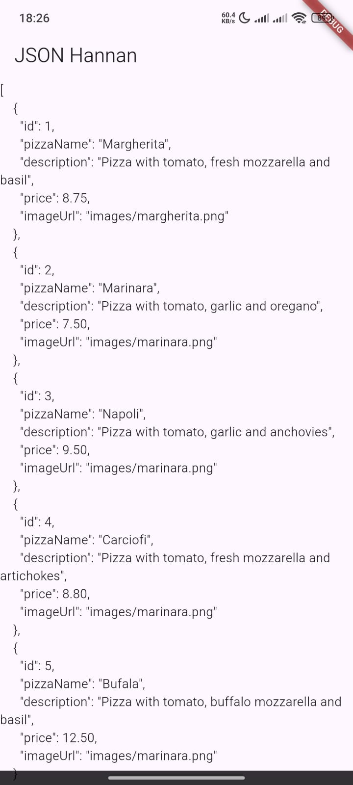
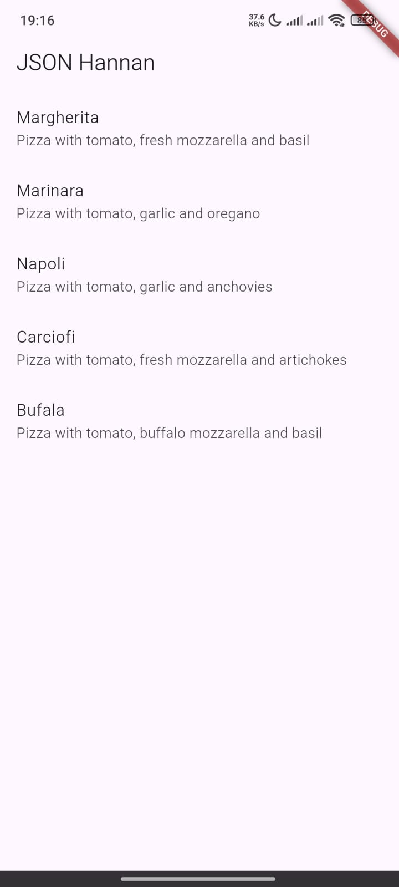
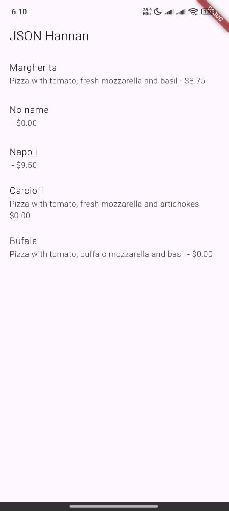

# Pemograman Mobile - Pertemuan 13   

## Soal 1

```dart
appBar: AppBar(
        title: const Text('JSON Hannan'),
      ),
```

```dart
theme: ThemeData(
        primarySwatch: Colors.orange,
      ),
```

## Soal 2



## Soal 3



**Debug Console**


## Soal 4


**Jawaban:**

Karena menggunakan variabel const untuk kunci JSON, yang mencegah kesalahan ketik (typo) dan memusatkan semua perubahan nama kunci hanya di satu tempat.

**Hasil Running:**




