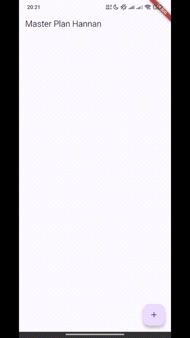
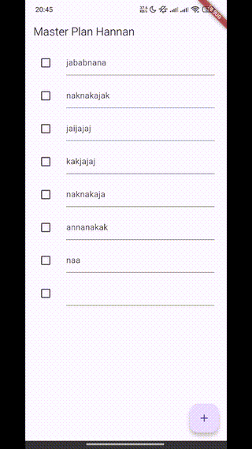
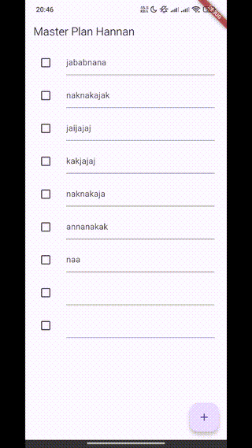

# Pemograman Mobile - Pertemuan  10   

Nama: Ahmad Dzul Fadhli Hanna   
Nomor: 02  
Kelas: TI3F  
NIM: 2341720106  

# Tugas 1

## Soal 1

**Penjelasan**: Saat dijalankan menampilkan ui dengan 1 tombol "+", dan saat ditekan muncul checklit yang field nya bisa diisi menggunakan teks dengan keyboard. Dan saat klik "+" lagi cheklistnya bertambah kebawah, tapi kursor keyboard nya tetap berada di list field yang sedang diedit. Saat dilakukan **hot reload** tidak terjadi apa-apa, tapi saat dilakukan **restart**, semua data yang sudah ditambahkan sebelumnya dalam list dihapus.

## Soal 2

**Penjelasan**: Agar saat impor model menjadi lebih ringkas karena hanya perlu memanggil file data_layer.dart maka akan mengimpor semua model yang diekspor didalamnya.

## Soal 3

**Penjelasan**: Plan diperlukan sebagai data model yang menampung list untuk ditampilkan dan dikelola pada UI, serta dibuat sebagai konstanta (const) agar nilainya tetap sehingga immutable/efisien selama widget aktif.

## Soal 4

**Menggunakan ScrollController**

**Tanpa Menggunakan ScrollController**

**Penjelasan**: ScrollController tidak digunakan, sehingga tidak ada listener yang akan otomatis menghilangkan/mengganti fokus keyboard saat scroll dilakukan.keyboardDismissBehavior pada ListView.builder menggunakan default (yaitu, keyboard tidak otomatis menghilang saat user scroll, terutama di iOS).

## Soal 5

**Penjelasan**: Method pada Langkah 11 digunakan untuk inisialisasi awal, yaitu membuat ScrollController dan menambahkan listener saat widget pertama kali dibuat, sedangkan method pada Langkah 13 digunakan untuk membersihkan resource dengan melepas ScrollController saat widget dihapus dari tree.

## Soal 6

Kumpulkan laporan praktikum Anda berupa link commit atau repository GitHub ke dosen yang telah disepakati !

