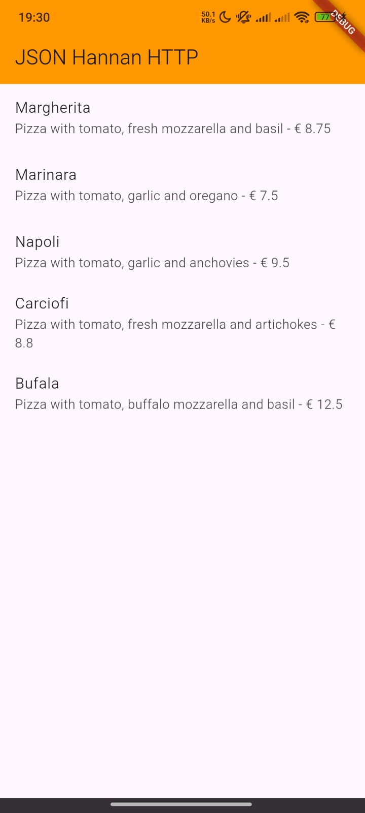
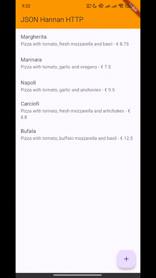

# Pemograman Mobile - Pertemuan 14  

## Soal 1

```dart
appBar: AppBar(title: const Text('JSON Hannan HTTP'), backgroundColor: Colors.orange,),
```

**Hasil Running:**



## Soal 2

**Tambahlan field baru:**

```dart
final String size;
```

**Pada Wiremock:**

check "Enable dynamic response templating"

pada body json:

{{{request.body}}}

**Hasil Running:**



