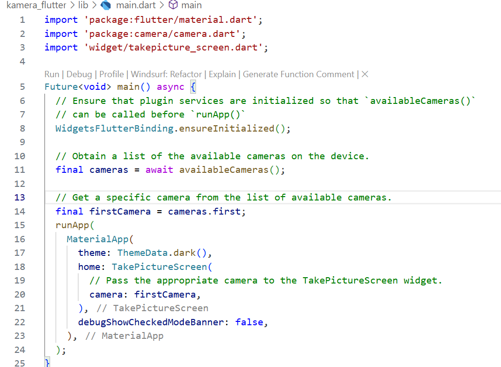
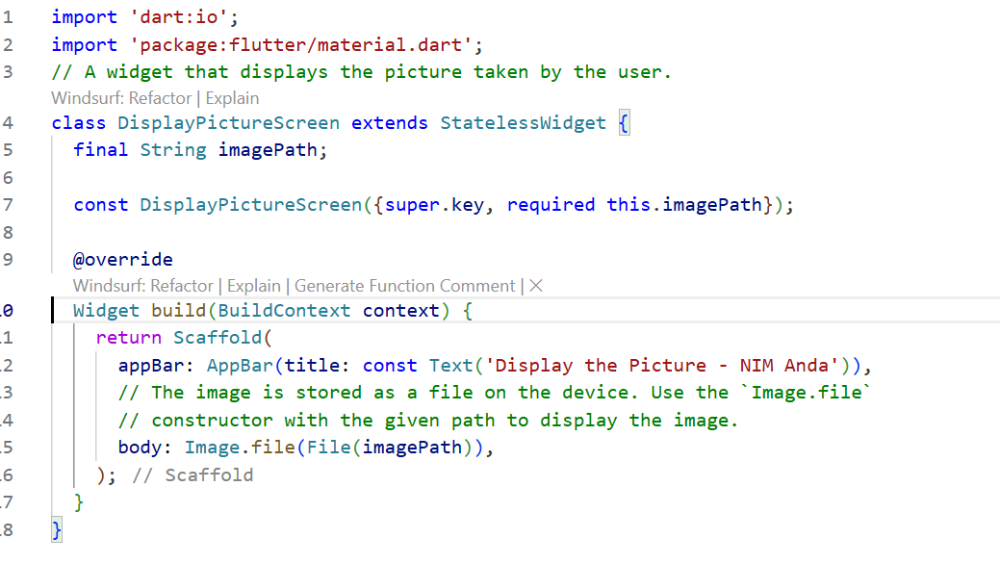
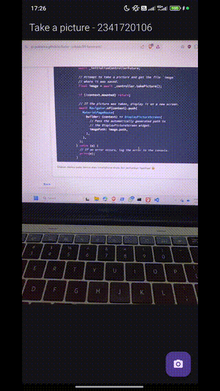
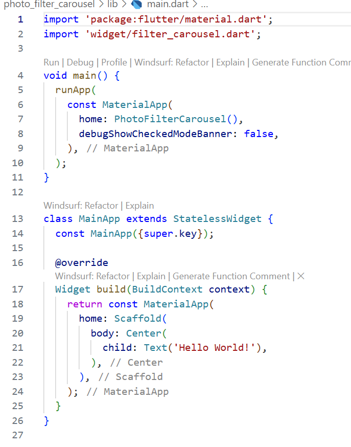
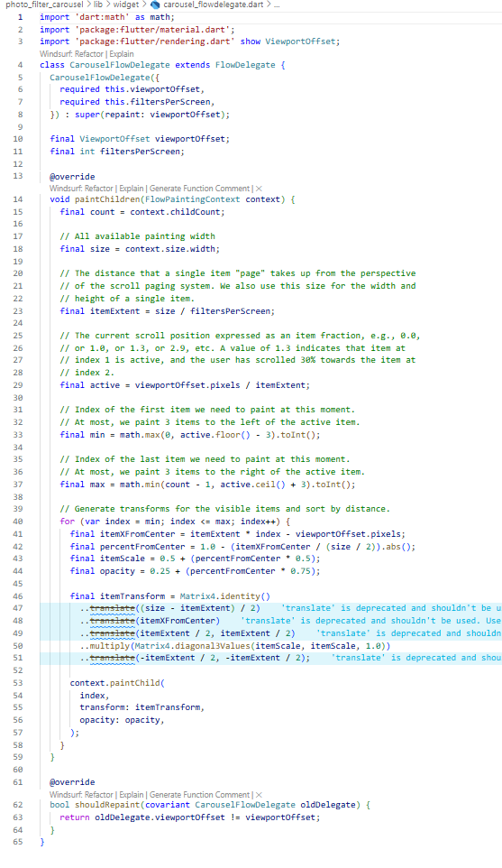
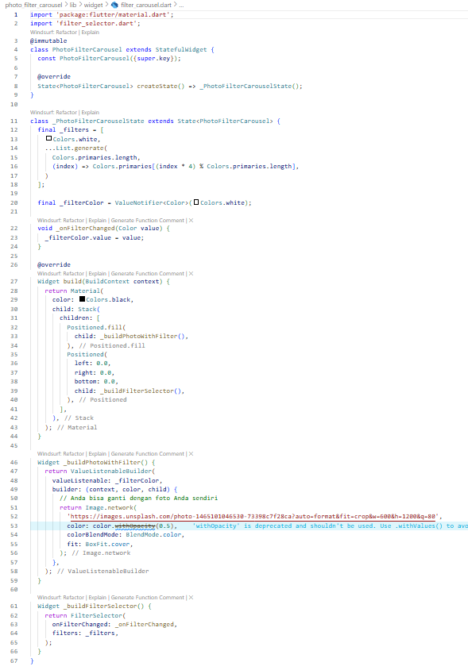
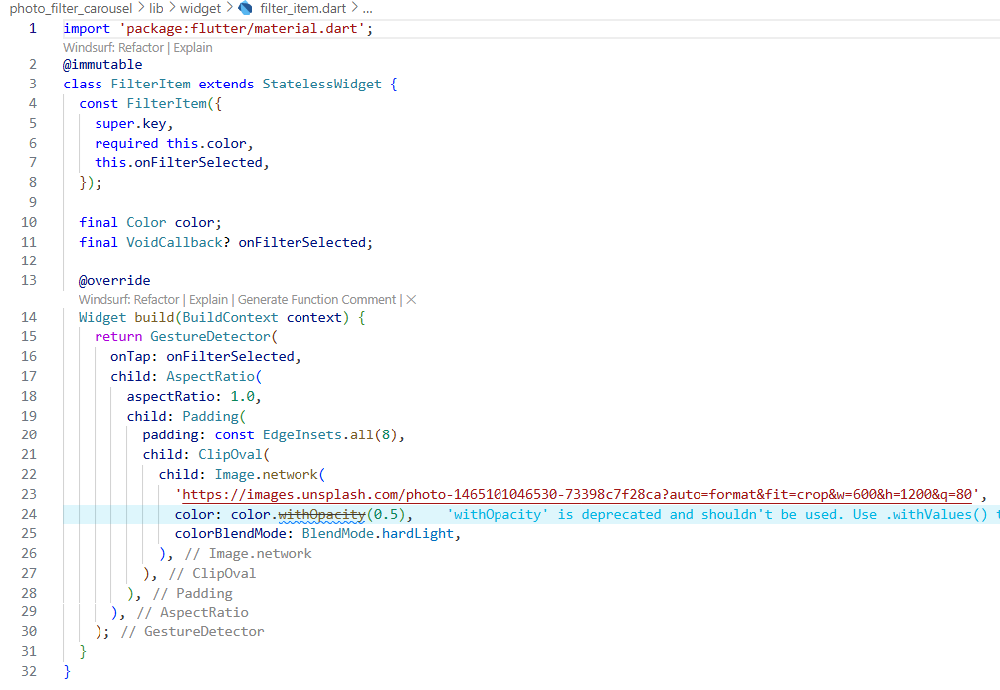
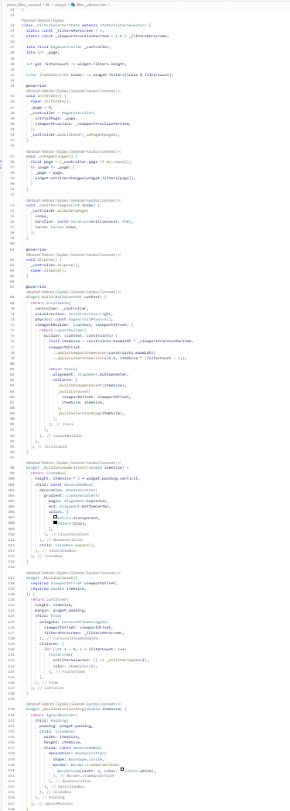
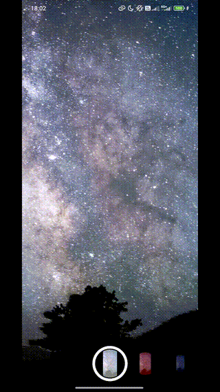
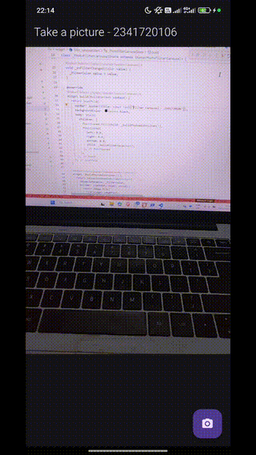

# Pemograman Mobile - Pertemuan 9  

Nama: Ahmad Dzul Fadhli Hannan  
Kelas: TI3F  
Absen: 02  
NIM:2341720106  

# TUGAS  

## Nomor 1

### Praktikum 1  

lib/main.dart

**Penjelasan:** WidgetsFlutterBinding.ensureInitialized(), mengambil daftar kamera yang tersedia di perangkat lewat availableCameras(), memilih kamera pertama, lalu menjalankan aplikasi Flutter dengan tema gelap dan menampilkan layar TakePictureScreen—di mana kamera yang dipilih dikirimkan sebagai parameter—sehingga widget itu nanti dapat menampilkan preview kamera dan mengambil foto; debug banner juga dimatikan.

**Penjelasan:** Menginisialisasi kamera perangkat saat dimulai, menampilkan preview kamera setelah siap menggunakan FutureBuilder, dan menyediakan tombol mengambill foto; ketika tombol ditekan, aplikasi mengambil foto lewat CameraController, lalu menavigasi ke layar DisplayPictureScreen untuk menampilkan hasilnya, sementara controller dibersihkan di dispose untuk mencegah kebocoran sumber daya.

**Penjelasan:** Menerima path file gambar (imagePath) sebagai parameter, lalu menampilkan layar (Scaffold) berisi AppBar dengan judul dan tubuh yang menampilkan gambar dari file tersebut menggunakan Image.file(File(imagePath)).

**Hasil Akhir**

### Praktikum 2

**Penjelasan:** memanggil runApp pada sebuah MaterialApp yang menampilkan PhotoFilterCarousel sebagai halaman utama dan menonaktifkan banner debug; 

**Penjelasan:** Membuat efek carousel: widget menerima posisi scroll (viewportOffset) dan berapa item terlihat per layar (filtersPerScreen), lalu menghitung lebar tiap item (itemExtent) dan indeks item aktif berdasarkan posisi scroll; hanya melukis rentang item di sekitar item aktif (untuk performa), dan untuk tiap item menghitung seberapa dekat item ke tengah layar untuk menentukan skala dan opacity, lalu membangun transformasi (translate + scale) sehingga item tampil terpusat dan menyusut/nered sesuai jarak, serta mengecat tiap child dengan transform dan opacity; repaint dipicu saat viewportOffset berubah.

**Penjelasan:** Menampilkan carousel filter sederhana: widget membuat daftar warna filter (_filters), menyimpan filter aktif dalam ValueNotifier (_filterColor), dan menampilkan foto (Image.network) yang di-overlay dengan warna filter saat nilai notifier berubah; di layar utama foto ditampilkan penuh (Positioned.fill) dan di bagian bawah ditempatkan FilterSelector yang menerima daftar filter dan memanggil onFilterChanged untuk mengubah warna aktif.

**Penjelasan:** Menampilkan sebuah tombol gambar bundar yang merepresentasikan satu filter: widget membungkus Image.network dengan AspectRatio(1.0) + Padding + ClipOval sehingga tampil sebagai lingkaran, lalu mengaplikasikan warna filter lewat color dan BlendMode.hardLight; pengguna bisa mengetuknya karena dibungkus GestureDetector yang memanggil onFilterSelected saat tap. 

**Penjelasan:** Komponen carousel filter berbasis PageController yang menampilkan daftar warna sebagai thumbnail bundar (FilterItem) menggunakan Flow dengan CarouselFlowDelegate untuk efek skala/opacity saat digulir; widget mengatur viewport (lebar tiap item berdasarkan filtersPerScreen), mendengarkan perubahan halaman untuk memanggil onFilterChanged ketika filter aktif berubah, dan memungkinkan user mengetuk thumbnail untuk menganimasikan scroll ke halaman tersebut; di atas carousel ada ring seleksi statis yang menunjukkan item tengah, serta ada padding dan bayangan gradient untuk efek visual.

**Hasil Akhir**

## Nomor 2

**Hasil Gabungan:**

## Nomor 3

**Jawaban:** Future<void> main() async — artinya fungsi main diberi modifier async sehingga bisa memakai await di dalamnya; karena ada await availableCameras() yang memanggil API asynchronous, async diperlukan untuk menunggu hasil tanpa mem‑block UI. Dengan async fungsi mengembalikan Future<void> (bukan void biasa), sehingga runtime tahu ada operasi async yang harus diselesaikan sebelum melanjutkan (di sini kita memastikan daftar kamera diperoleh dan plugin di‑inisialisasi dulu lewat WidgetsFlutterBinding.ensureInitialized()), lalu setelah hasilnya didapat runApp() dipanggil.

## Nomor 4

**Jawaban:** @immutable menandakan bahwa sebuah kelas seharusnya bersifat tak berubah (instance-nya hanya berisi field final), sehingga analyzer akan memberi peringatan jika ada field non‑final—biasanya dipakai untuk widget atau model yang harus immutable untuk mencegah bug; sedangkan @override dipakai di atas metode/getter/setter yang menimpa deklarasi di superclass atau interface untuk memberitahu analyzer/ pembaca bahwa ini override, membantu mendeteksi kesalahan pengetikan atau tanda tangan yang tidak cocok dan membuat kode lebih jelas.