# MOBILE - Pertemuan 6  

# Tugas Praktikum 1  

## Nomor 1

### P1  

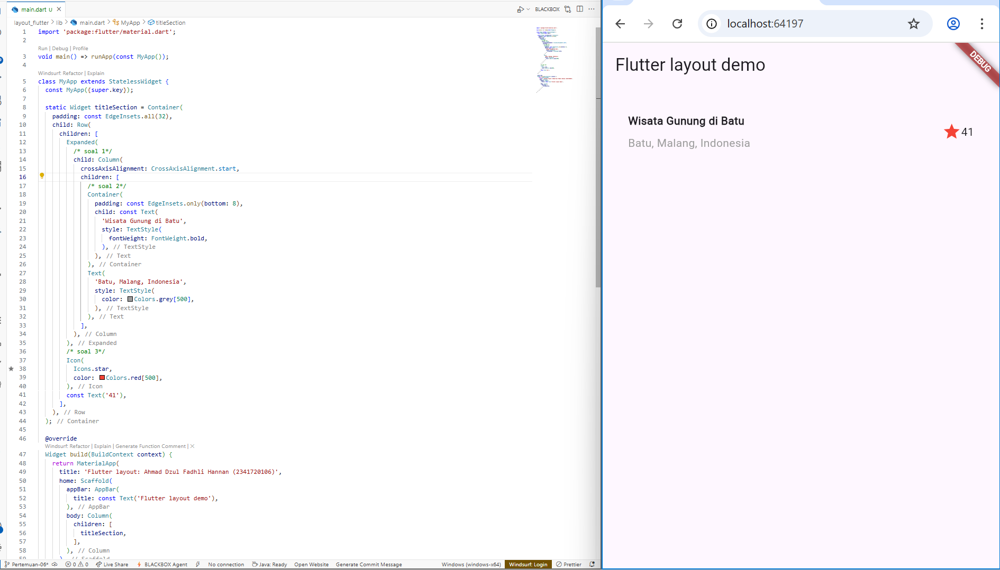  

**Penjelasan:** Cara mendefinisikan sebuah widget titleSection yang menggunakan Row untuk menampilkan tata letak judul dan subjudul di sebelah kiri, serta sebuah ikon dan teks di sebelah kanan.

### P2  

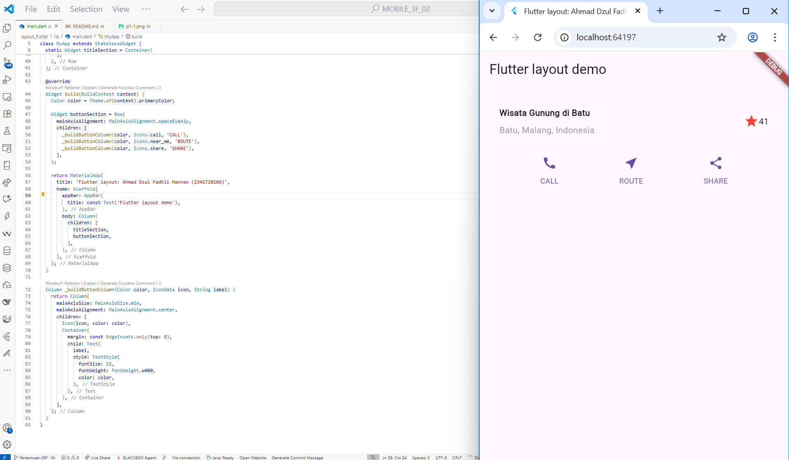

**Penjelasan:** Cara mendefinisikan sebuah widget buttonSection sebagai baris (Row) yang berisi tiga tombol (CALL, ROUTE, SHARE) yang dibuat menggunakan fungsi bantuan _buildButtonColumn, di mana setiap tombol terdiri dari ikon dan teks yang diwarnai dengan warna utama tema aplikasi.

### P3  

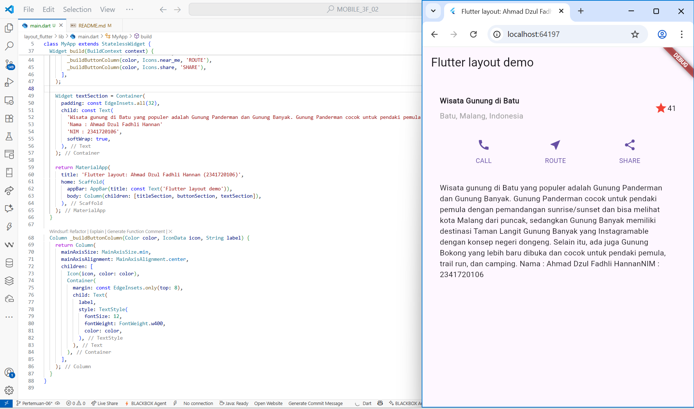

**Penjelasan:** Cara mendefinisikan sebuah widget bernama textSection yang merupakan sebuah Container dengan padding 32 piksel, berisi blok teks instruksional yang dapat membungkus teks secara otomatis (softWrap).

### P4  

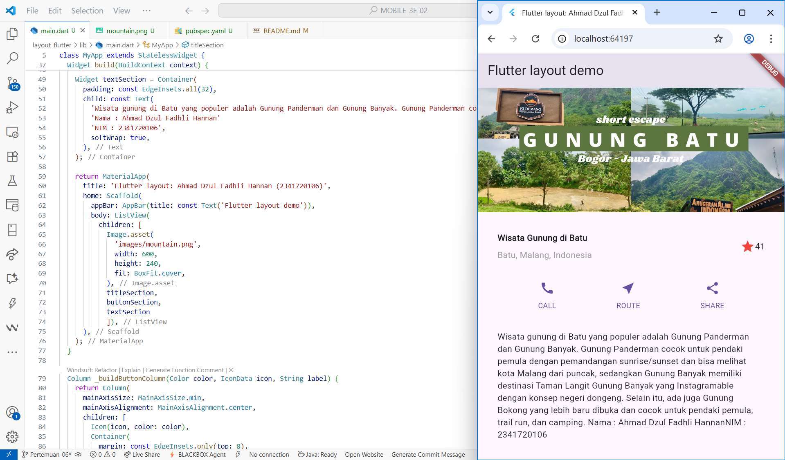

**Penjelasan:**  Cara mendefinisikan sebuah gambar dengan membuat folder images didalam assets, lalu mengimpor gambar ke pubspec.yaml, kemudian menampilkannya didalam body. Dan terakhir mengganti column menjadi ListView agar halaman bisa menampilkan semua konten dalam berbagai ukuran layar device tanpa terpotong.

## Nomor 2

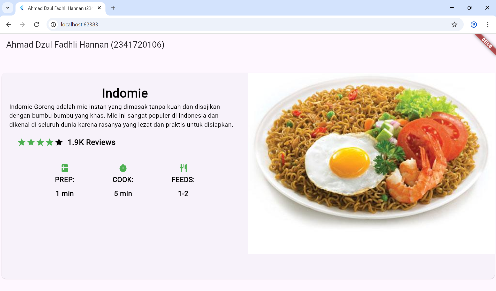

# Tugas 2

## Nomor 1

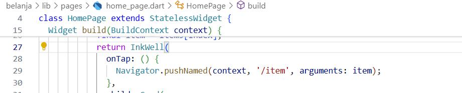

**Penjelasan:** modifikasi home_page bagian onTap dengan menambahkan arguments: item untuk mereturn value item yang diklik.

## Nomor 2

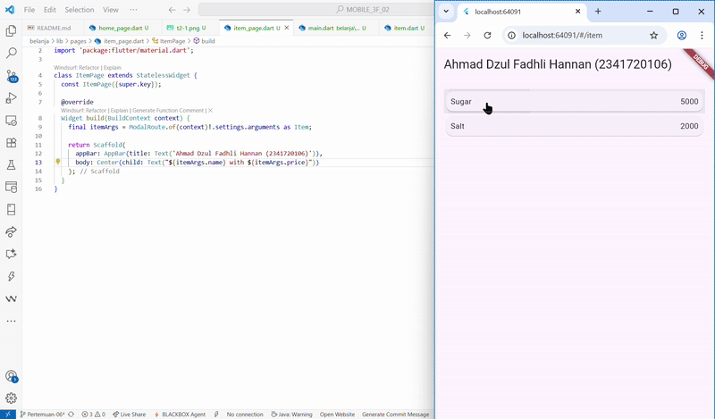

**Penjelasan:** Menerima return value dari arguments home_page ke item_page.

## Nomor 3

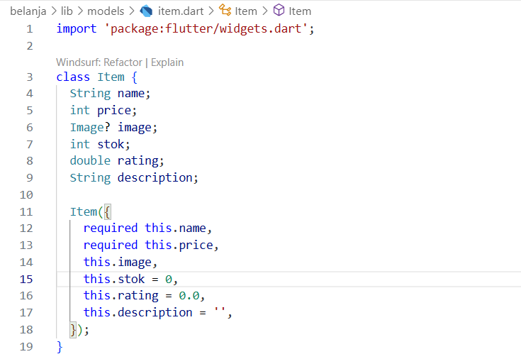

**Penjelasan:** Tambahkan atribut image, stok, rating, dan deskripsi pada model item.

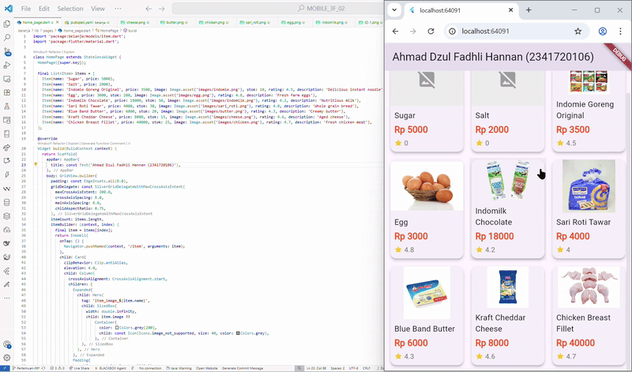

**Penjelasan:** Menampilkan list item dalam bentuk gridView seperti aplikasi marketplace pada umumnya.

## Nomor 4

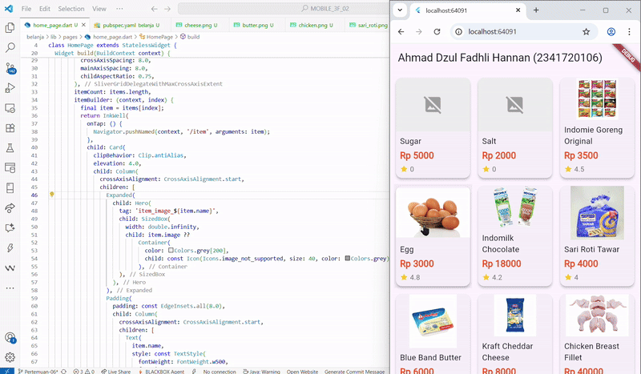

**Penjelasan:** Menambahkan Hewo widget untuk navigasi dari home_page ke item_page sesuai dengan item yang diklik.

## Nomor 5

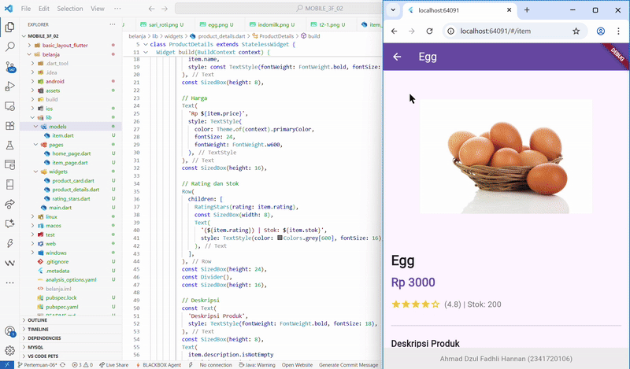

**Penjelasan:** Modifikasi header warna ungu dan footer menampilkan nama dan nim pada home_page dan item_page.

## Nomor 6

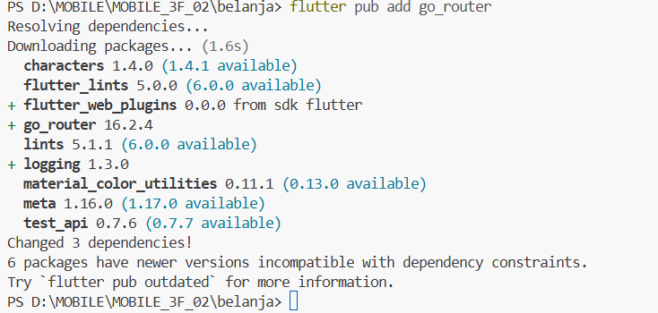

**Penjelasan:** Install go_router di terminal.

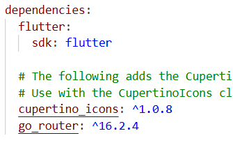

**Penjelasan:**  Kofigurasi go_router pada pubspec.yaml

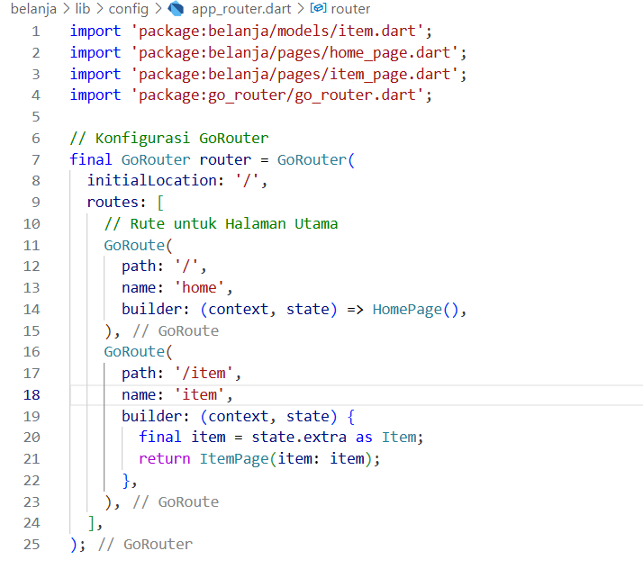

**Penjelasan:** Tambahkan app_router.dart pada lib/config dan set path dan name page yang ingin dituju.

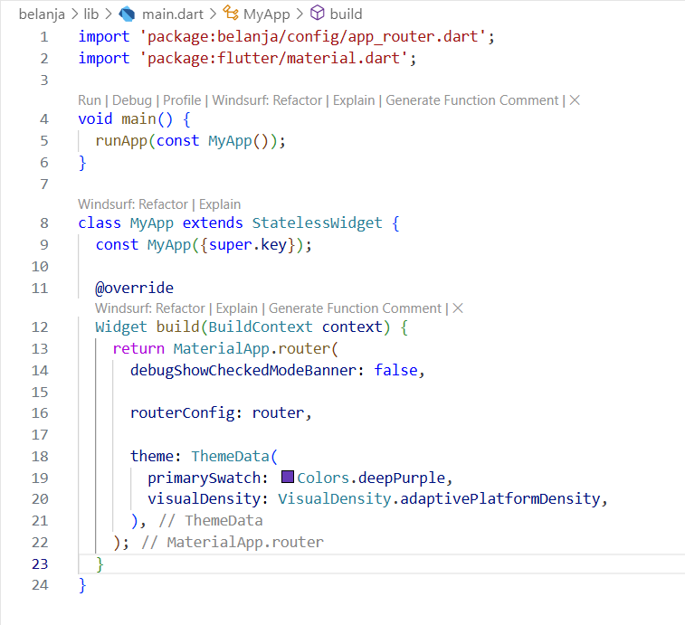

**Penjelasan:** Modifikasi main.dart untuk mereturn MaterialApp sebagai route dari app_router.dart.

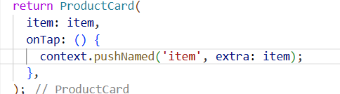

**Penjelasan:** modifikasi home_page pada onTap ganti menjadi pushNamed route ke 'item' dan mereturn value dari item.

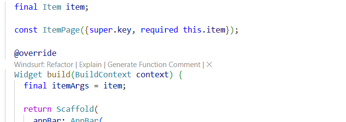

**Penjelasan:** Modifikasi item_page pada bagian konstruktor item menjadi seperti di atas.

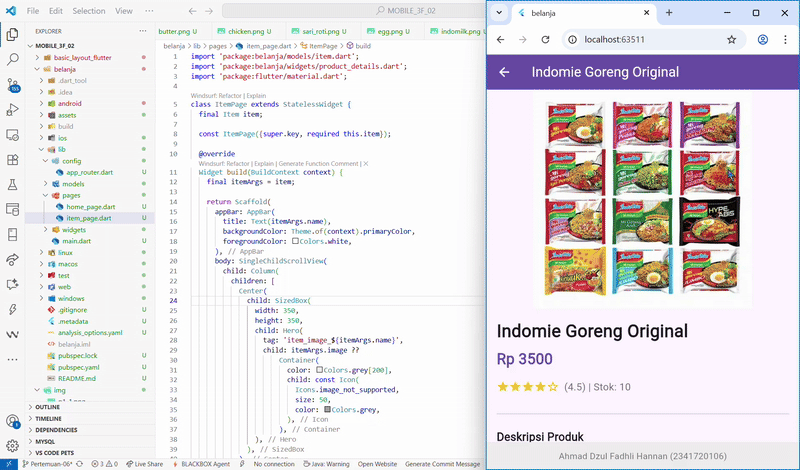

**Penjelasan:** Tampilan akhir dari penerapan go_route. Tidak ada yang berubah, tapi dengan menggunakan go_route kita bisa memanggil route dengan lebih mudah karena route bisa didefinisikan dengan nama dalam String.

