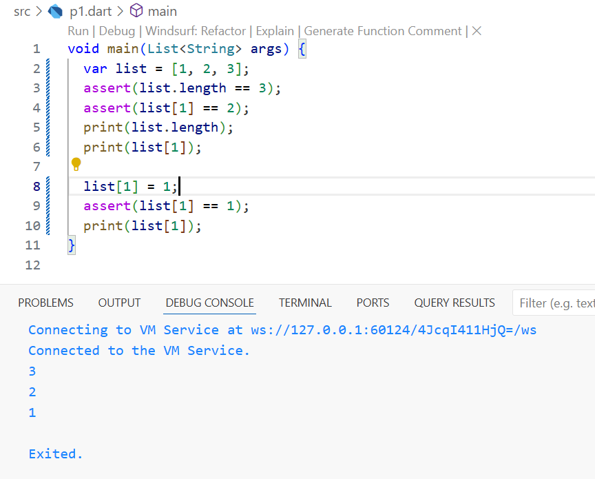
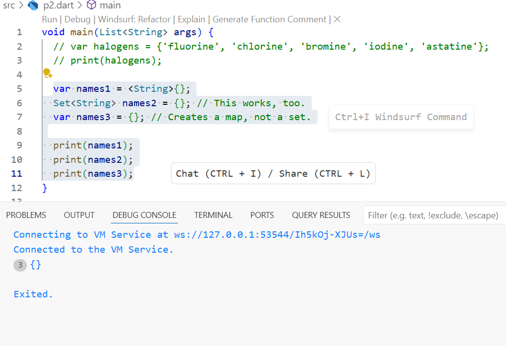
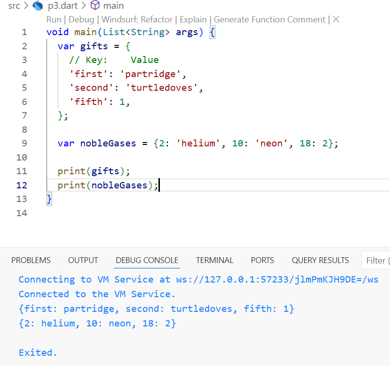
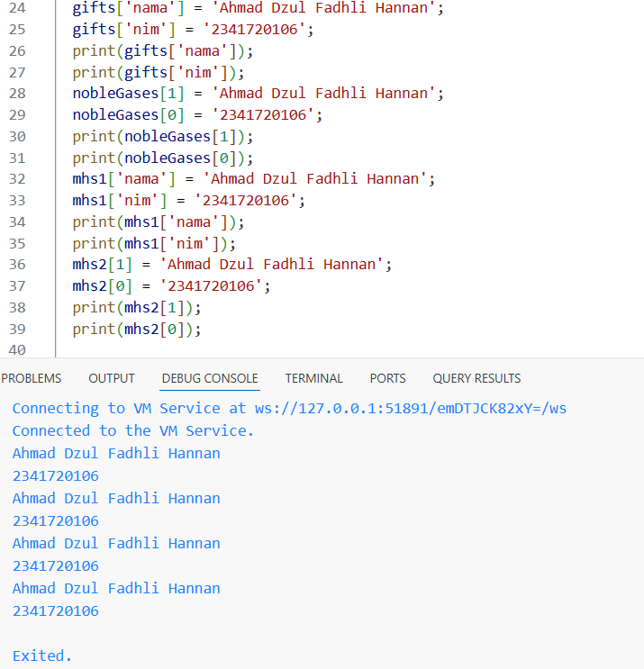

# Pemograman Mobile - Pertemuan 3  

## Praktikum 1  
Langkah 1  
Langkah 2  
  
Menampilkan "Test2" dan "Test2 again" karena memeriksa if else var test bernilai "test2
Langkah 3  
  
Error karena variabel dideklarasikan duplikat dan tipe data String tidak bisa untuk perekondisian if-else dan harus diganti dengan bool.  
  
Menampilkan "Kebenaran" karena memeriksa if else var test2 bernilai true

## Praktikum 2  
Langkah 1  
Langkah 2  
  
error karena var counter tidak didefinisikan. var counter didefinisikan dengan tipe data int dan diberi nilai supaya saat while bisa dijalankan.  
  
Menampilkan perulangan angka 0-32

Langkah 3  
  
error karena var counter tidak didefinisikan. var counter didefinisikan dengan tipe data int dan diberi nilai supaya saat melalukan perulanagan do kondisi while bisa dijalankan.  
  
Menampilkan perulangan angka 0-76  

## Praktikum 3  
langkah 1  
Langkah 2  
  
Error karena tipe data tidak didefinisikan dan nama variabel berbeda-beda padahal harusnya sama.  
  
Menampilkan perulangan angka 10-26  

Langkah 3  
  
Error karena kondisi if else harus huruf kecil semua dan nama variabel harus sama semua.  
  
Tidak menampilkan perulangan angka karena semua kondisi tidak terpenuhi.  

## Tugas  
  
Penjelasan program:  
Menampilkan deretan angka dari 0 hingga 201, lalu melakukan pengecekan apakah setiap angka tersebut merupakan bilangan prima. Jika angka adalah bilangan prima, program akan mencetak angka tersebut diikuti dengan nama dan NIM, sedangkan untuk angka yang bukan bilangan prima hanya mencetak angkanya saja. Pengecekan bilangan prima dilakukan dengan mengasumsikan angka sebagai prima, kecuali angka kurang dari 2 atau memiliki pembagi selain 1 dan dirinya sendiri, yang dideteksi dengan perulangan dari 2 hingga setengah dari nilai angka tersebut. 