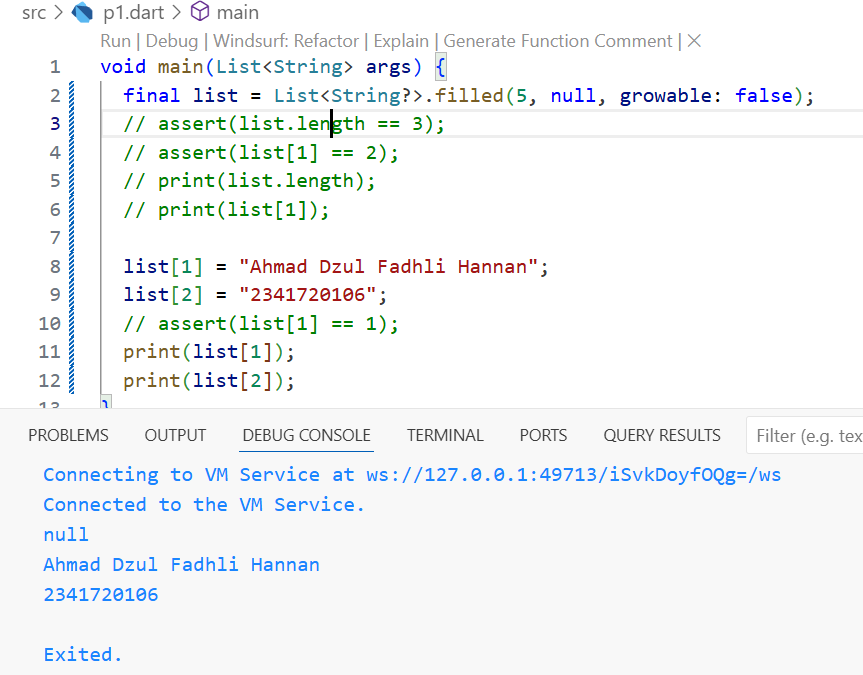
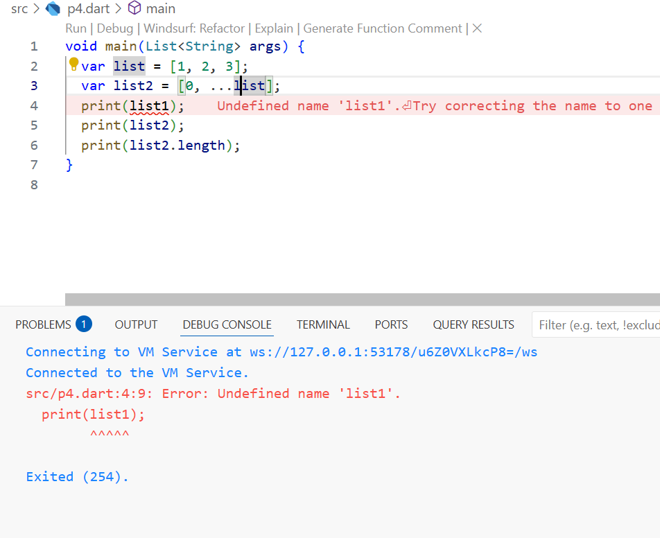
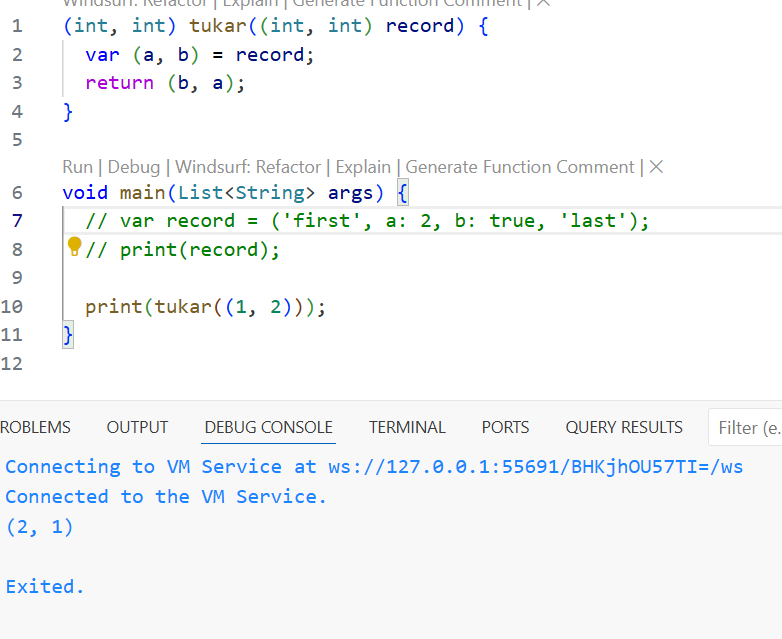

# Pemograman Mobile - Pertemuan 4

# Tugas Praktikum

# Soal 1

## P1

### Langkah 1

### Langkah 2

  
Inisiasi var list, mengecek dengan asert apa length sama dengan 3 jika salah maka akan error. Lalu cek apakah list[1] sama dengan 3 dengan asert. Lalu print lenght dan list[1]. Lalu set list[1] menjadi 1. Kemudian cek dengan asert apa list[1] sama dengan 1. Terakhir print 1.

### Langkah 3

  
Set list menjadi variabel final dengan lenght 5 dan berisi nilai null, kemudian set list 1 dan 2 dengan nama dan nim lalu di print.

## P2

### Langkah 1

### Langkah 2

  
Menampilkan map dari var halogens.

### Langkah 3

  
Hanya menampilkan '3{}'.  

## P3

### Langkah 1

### Langkah 2

  
Menampilkan isi dari var gifts dan nobleGases.

## Langkah 3

  
Deklarasi var mhs1 map String String dan mhs2 map int String, lalu mengganti value dari setiap map var gifts dan nobleGases.  

## P4

### Langkah 1

### Langkah 2

  
Error, perbaikan kodennya: 
  
Deklarasi list1 yang berisi 1,2,3 dan list2 yang berisi 0, dan value dari list1. Lalu print list1 dan list2.

### Langkah 3

  
Error, perbaikan kodenya:  
  
Deklarasi variabel list1b yang berisi 1, 2, null dengan int? agar null bisa diterima lalu print list1b. Lallu deklarasi var list3 yang berisi 0, dan value dari list1b menggunakan ...? agar null diabaikan tapi tetap terbaca. Terakhir print length dari list 3 yaitu 4.

### Langkah 4

  
Error, perbaikan kodenya: 
  
Deklarasi var promoActive dengan nilai true lalu var nav dengan isi Home, Furnitur, Plants, dan Outlet(Jika promoActive bernilai true). Menampilkan nav.
Mengganti var promoActive dengan nilai false lalu var nav2 dengan isi Home, Furnitur, Plants, dan Outlet(Jika promoActive bernilai true). Menampilkan nav2 yang tidak termasuk Outlet.

### Langkah 5

  
Error, perbaikan kodenya:  
  
Deklarasi var login dengan nilai Manager. Lalu var nav2 yang berisi Home, Furniture, Plats dan Inventory(Jika case login adalah Manager). Lalu menampilkan nav2 dengan value login Manager. 
Mengganti var login dengan nilai User. Lalu var nav3 yang berisi Home, Furniture, Plats dan Inventory(Jika case login adalah Manager). Lalu menampilkan nav3 tanpa Inentory karena case login bukan Manager.

### Langkah 6

  
Deklarasi var listOfInts dengan nilai 1,2,3. Lalu deklarasi var listOfStrings yang berisi nilai #0 dan setiap value dari var listOfInts yang dimodifikasi menjadi string menjadi #i untuk i adalah setiap value dari listOfInts. Lalu dicek dengan assert apakah listOfStrings[1] adalah #1, hasilnya benar dan tidak error. Lalu menampilkan isi dari listOfStrings.

Manfaat dari Collection for adalah supaya mempersingkat dari penulisan kode perulangan for. Dokumentasi hasilnya ada pada line 28 Langkah 6 yang mana penggunaan Collection for digunakan untuk memodifikasi value dari listOfInts menjadi String dengan tambahan tanda #.

## P5

### Langkah 1

### Langkah 2

  
Menampilkan isi dari var record dengan urutan field posisional dahulu yaitu first sebagai index 1, lalu last sebagai index 2, kemudian field named a lalu b. Tipe data records ini hanya bisa digunakan pada Dart versi 3.0 keatas.

### Langkah 3

  
Deklarasi fungsi tukar, yang berfungsi untuk menukan posisi dari 2 value bertipe data int.

### Langkah 4

  
Error, perbaikan kodenya:  
  
Deklarasi variabel record mahasiswa yang berisi String dan int. Lalu memberikan valuenya dengan nama String dan NIM int. Lalu menampilkan variabel mahasiswa.

### Langkah 5

  
Deklarasi var record mahasiswa2 field posisional first index 1 dan last index 2, kemudian field named a dan b. Kemudian di print var mahasiswa2 dengan urutan index 1, a, b, dan index 2.  
Mengganti salah satu record dengan Nama dan NIM  :

# Soal 2

Function adalah blok kode yang dapat dipanggil (dieksekusi) untuk melakukan tugas tertentu dan dapat mengembalikan nilai.

# Soal 3

## 1. Parameter Posisi

Parameter yang harus diisi berdasarkan urutan posisinya saat pemanggilan fungsi.

## 2. Parameter Posisi Opsional

Parameter yang boleh diisi atau tidak, ditulis dalam tanda [ ]. Jika tidak diisi, nilainya `null` atau pakai default.

## 3. Parameter Bernama

Parameter yang dipanggil berdasarkan nama, ditulis dalam tanda { } dan biasanya lebih fleksibel.

## 4. Parameter Bernama Opsional

Parameter bernama yang boleh diisi atau tidak, dan dapat diberi nilai default.

## Contoh Sintaks  

# Soal 4

## Penjelasan

Functions sebagai first-class objects artinya fungsi di Dart bisa diperlakukan seperti data:  
bisa disimpan di variabel, dikirim atau dikembalikan lewat fungsi lain, dan disimpan dalam struktur data.  

## Contoh Sintaks Functions First-Class di Dart

  

# Soal 5  

Anonymous Function adalah fungsi yang tidak memiliki nama yang biasanya digunakan sebagai fungsi sementara (inline), misalnya sebagai argumen pada fungsi lain, atau ketika fungsi hanya perlu digunakan sekali.

Contoh  

# Soal 6  

Lexical scope adalah aturan penentuan akses variabel berdasarkan posisi penulisan kode (saat kode ditulis, bukan saat dijalankan). Variabel hanya bisa diakses di dalam blok tempat variabel tersebut dideklarasikan, serta di blok-blok di dalamnya (nested).

Lexical closure adalah fungsi yang menyimpan atau “mengikat” variabel dari lingkungan (scope) tempat dia didefinisikan, meskipun fungsi itu dijalankan di luar scope asalnya. Closure memungkinkan fungsi “mengingat” nilai variabel di scope saat fungsi itu dibuat.

### Contoh

# Soal 7  
